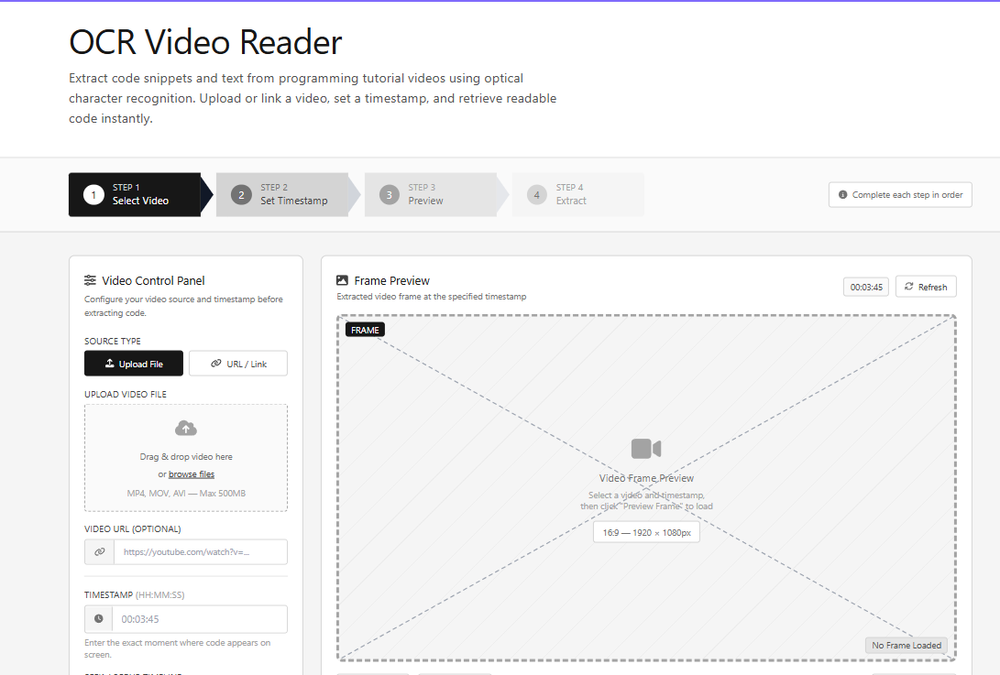
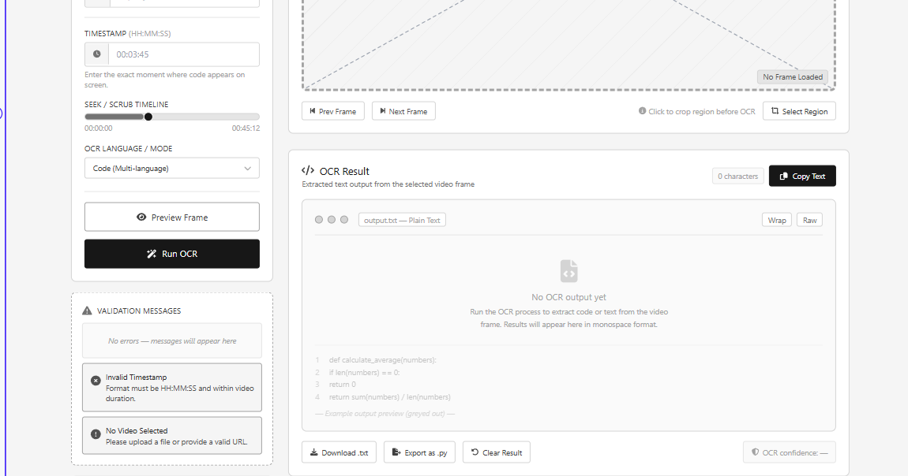

#Wireframes

This wireframe shows the planned interface for the OCR Video Reader.
The MVP version will use a preloaded video from the "resources" folder, 
while video upload and URL support may be added as future improvements.

## Main Workflow:

The main completed workflow is:

1. select the demo video.
2. enter a timestamp.
3. preview a frame.
4. run OCR.
5. Display the extracted text.

## Assessment Requirements Covered

The design includes:
- validation messages. 
- accessibility controls.
- frame preview
- OCR result display.

These features support the project requirements for client/server interaction,
multimedia support, client-side validation, and personalisation.

## Wireframe - Visual representation.

